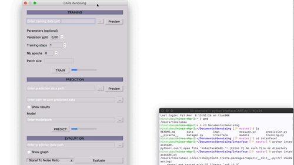

# Denoising 3D microscopy images with CSBDeep

This is an application of CSBDeep network for **denoising microscopy images**. It is also possible to load other pre-trained models (.h5 files) to denoise images. this application can be run through the [terminal](#Command) or through the [interface](#Interface). Finally, it also gives a method to evaluate denoising through different metrics such as signal-to-noise ratio, structural similarity index and jaccard index.


   
    
</br> </br> </br> </br> </br> </br> </br> </br> </br> </br> </br> </br> </br> </br> </br> </br> </br> </br> </br> 


## Setup

### Prerequisites
- Linux or OSX

### Getting started
- Install [python](https://realpython.com/installing-python/)

- Install package (numpy, napari, tensorflow, [csbdeep](http://csbdeep.bioimagecomputing.com/doc/install.html) etc.) 
```bash
pip install -r requirements.txt 
```
OR
since installing TensorFlow with its dependencies (CUDA, cuDNN) can be challenging, there is a ready-to-use [Docker container](https://hub.docker.com/r/tboo/csbdeep_gpu_docker/) as an alternative to get started more quickly. 

- Clone this repository
```bash
git clone https://github.com/ninatubau/denoising.git
```
## Data

The dataset has to follow a particular structure as following:


## Interface



```bash
cd interface
python interfaceCARE.py
```

## Terminal 

### Data preparation and training

Preparation of the data and training on noise and clean images

Arguments:
- data_path: Path to your input data: noisy (low intensity) and clean(high intensity) folder with .tif files
- *axes: Axes to indicate the semantic order of the images. Examples : ZYX, CXY ..., default XYZ* 
- *validation_split: Ratio of validation data for training, default 0.1*
- *train_steps_per_epochs: Number of training steps per epochs, default 100*
- *train_epochs: Number of epochs, default 10*
- *model_name: Name of the model saved in the models folder, default my_model*
- *patch_size: Size of patches to train the model, default (16,16,64)*

*optional arguments*

Outputs: 
- Plot of noisy/clean data
- Plot of loss
- Creation CSV file *loss.csv* with values of loss

```bash
python training.py path/to/dataset --optional_parameter value
```

### Prediction

Prediction of noisy images -> DENOISING

Arguments:
- path_data: Path to to_predict folder data
- name_model: Name of the model to use as trained model 
- *n_tiles: Number of tiles for evey image axes to avoid out of memory issues, default (1,4,4)*
- *axes: Axes to indicate the semantic order of the images. Examples : ZYX, CXY ..., default XYZ*
- *plot_prediction: Boolean value to plot some images after the prediction, default False*
- *filter_data: Filter dat the you want to predict. Examples: all, ch0, ch1, default all*


*optional arguments*

Output:
- Plot of evaluated images

```bash
python prediction.py path/to/data/to_predict --optional_parameter value
```


### Measure

Measurement of the results using Signal to noise ratio, structural similarity index and jaccard index

Arguments:
- data_path: Path to your data

Outputs:
- Box plot comparing noisy/ground_truth and result/ground_truth based on several metrics

```bash
python measure.py path/to/data/dataset 
```

## TO DO
- [x] Documentation
- [x] Link website with results (images and videos)
- [x] Clean code
- [ ] Finish interface


## Acknowledgment

Code borrows heavily from [CSBDeep](https://github.com/CSBDeep/CSBDeep) published on [Content-Aware Image Restoration: Pushing the Limits of Fluorescence Microscopy](https://www.biorxiv.org/content/10.1101/236463v1)
