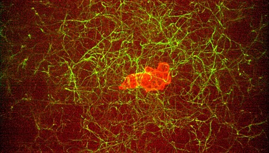
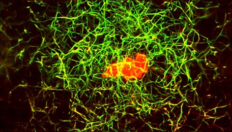
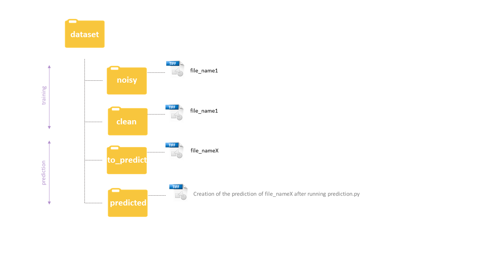

# Denoising 3D microscopy images with CSBDeep

This is an application of CSBDeep network for denoising microscopy images.




[Martin Weigert](https://www.biorxiv.org/content/10.1101/236463v1)

## Setup

### Prerequisites
- Linux or OSX

### Getting started
- Install python https://realpython.com/installing-python/
- Install tensorflow https://www.tensorflow.org/install/
```bash
# Current stable release for CPU-only
pip install tensorflow 
```
- Install CSBDeep package http://csbdeep.bioimagecomputing.com/doc/install.html
```bash
pip install csbdeep 
```
OR
since installing TensorFlow with its dependencies (CUDA, cuDNN) can be challenging, there is a ready-to-use [Docker container](https://hub.docker.com/r/tboo/csbdeep_gpu_docker/) as an alternative to get started more quickly. 

- Clone this repository
```bash
git clone https://github.com/ninatubau/denoising.git
```
## Data

The dataset has to follow a particular structure as following:



## Data preparation and training

Preparation of the data and training on noise and clean images

Arguments:
- data_path: Path to your input data: noisy (low intensity) and clean(high intensity) folder with .tif files
- *axes: Axes to indicate the semantic order of the images. Examples : ZYX, CXY ...* 
- *validation_split: Ratio of validation data for training*
- *train_steps_per_epochs: Number of training steps per epochs*
- *train_epochs: Number of epochs*
- *model_name: Name of the model saved in the models folder*

*optional arguments*

Outputs: 
- Plot of noisy/clean data
- Plot of loss
- Creation CSV file *loss.csv* with values of loss

```bash
python training.py path/to/dataset --optional_parameter value
```

## Prediction

Prediction of noisy images -> DENOISING

Arguments:
- path_indata: Path to to_predict folder data
- name_model: Name of the .h5 file to use as trained model
- *axes: axes to indicate the semantic order of the images. Examples : ZYX, CXY ...*
- *plot_prediction: True or False to plot some images after the prediction*

*optional arguments*

Output:
- Plot of evaluated images

```bash
python prediction.py path/to/data/to_predict --optional_parameter value
```


## Measure

Measurement of the results using Signal to noise ratio, structural similarity index and jaccard index

Arguments:
- data_path: Path to your data

Outputs:
- Box plot comparing noisy/ground_truth and result/ground_truth based on several metrics

```bash
python measure.py path/to/data/dataset 
```

##Acknowledgment
